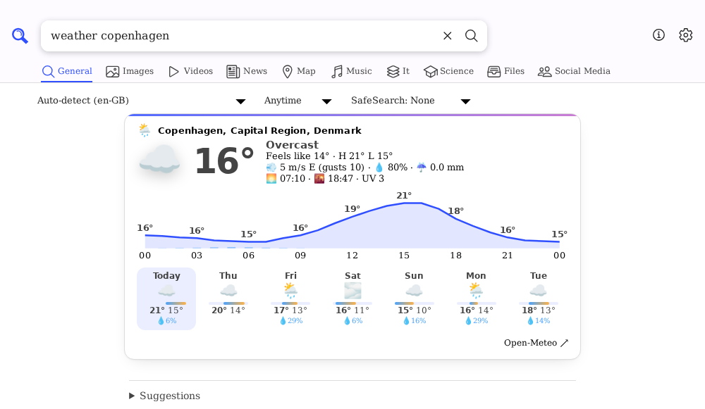
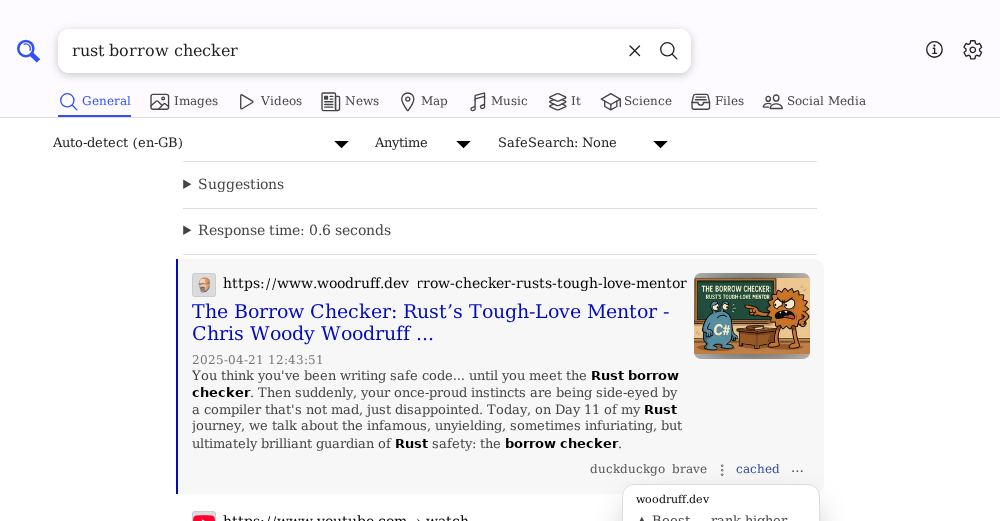
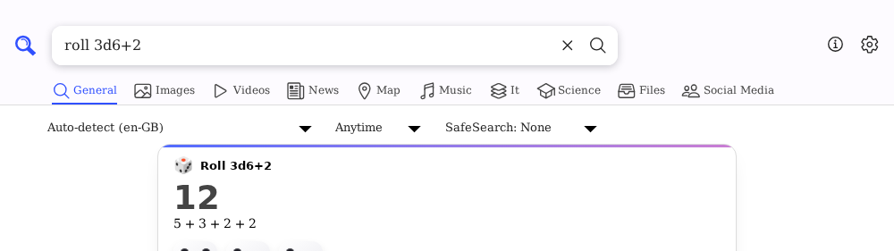
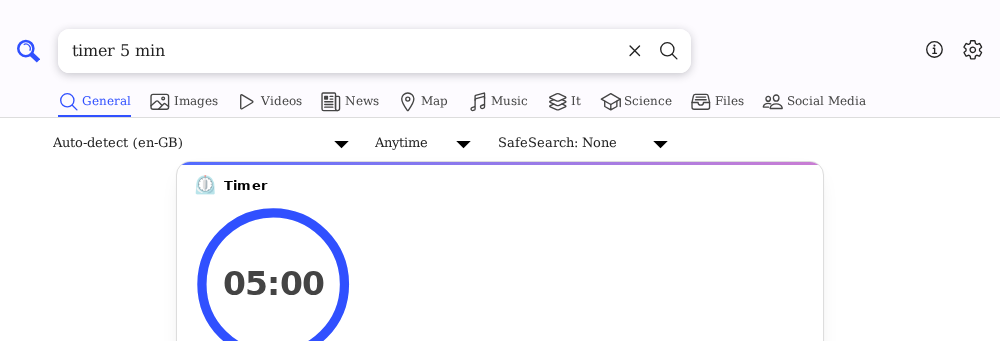
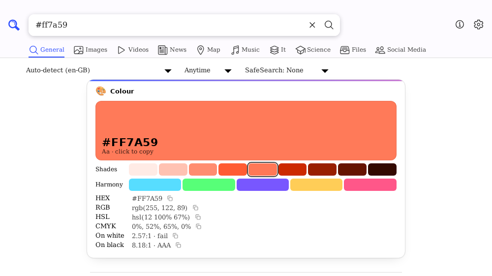
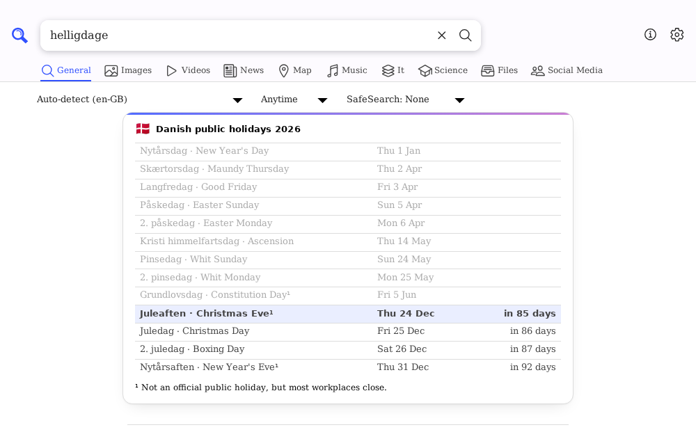
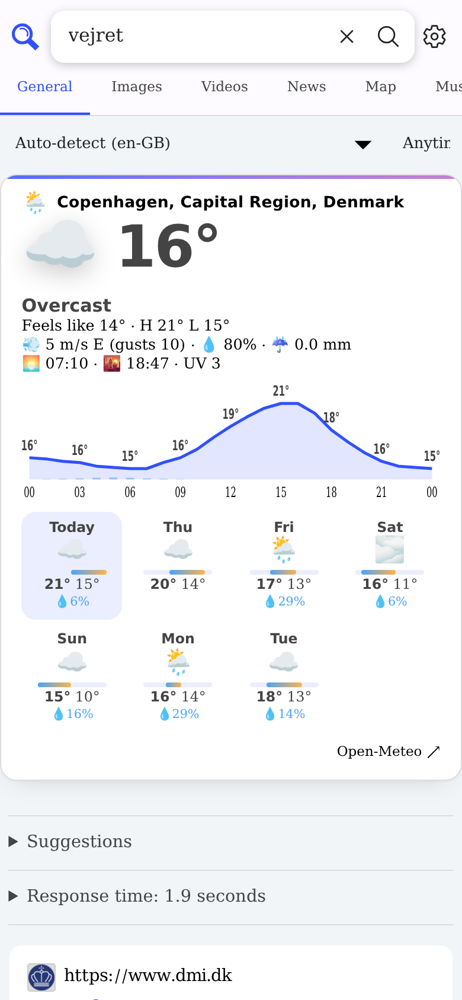

# searxng-instant-answers

Instant-answer cards and per-browser site ranking for [SearXNG](https://github.com/searxng/searxng). Dice, coin flips, timers, weather, week numbers, colour pickers, subnet calculators and more, plus a ⋯ menu on every result to boost, lower or block that site.

> [!WARNING]
> **This is 100% vibe coded.** An AI wrote all of it in one evening for my own self-hosted instance, and it's shared as is. I've clicked through it and it works for me, but it hasn't had a careful human review, it has no test suite, and it reaches into SearXNG internals that can change without notice. I'm publishing it because it seemed better to make it available than to leave it sitting unshared in a private config repo. Read the code before you run it, and expect to fix things when SearXNG updates. Issues and PRs are welcome, but there are no promises.

Tested against SearXNG master from **2026-09-22** (`2ed96e6f`) on NixOS.

| | |
|---|---|
|  |  |
|  |  |
|  |  |

<p align="center"></p>

## What's in it

### `plugins/smallapp_answers.py`: about 45 instant answers
Search **`help`** on your instance to get a card listing all of them as clickable examples ([screenshot](screenshots/help.png)).

- **Fun & random:** `roll 2d6+3`, `d20`, `flip a coin` / `plat eller krone`, `random number 1-100`, `pick pizza, sushi or tacos`, `shuffle a, b, c`, `8ball …`, `yes or no`, playable `rock paper scissors`. Everything re-rolls in the browser with a small animation.
- **Generators:** `password 24` (length slider, regenerated client-side with `crypto.getRandomValues`), `uuid` / `uuid v7`, `lorem ipsum 3`, `qr <text>` (needs [`segno`](https://pypi.org/project/segno/)).
- **Timers & time:** `timer 5 min`, `25 minute timer`, `pomodoro`, `stopwatch` (with laps). There's a countdown ring, a beep, and the time left in the tab title. Also `time in tokyo` (live clock), `unix 1767225600`, `timestamp`, `moon phase`.
- **Dates:** `days until christmas`, `dage til juleaften`, `days between 1/1/2026 and 24/12/2026`, `today + 90 days`, `100 days ago`, `what day is 24/12/2026`, `week` / `uge 42` (with a mini calendar), `today`, `is 2028 a leap year`, `helligdage 2027` (Danish public holidays), `easter 2027`, `age 1995-04-12`.
- **Weather:** `weather aarhus`, `vejret i odense`, `copenhagen weather`. Current conditions, a 24-hour temperature/rain chart and a 7-day forecast, from [Open-Meteo](https://open-meteo.com) (no API key).
- **Maths & money:** `15% of 80`, `20 is what percent of 80`, `80 + 25%`, `change from 80 to 100`, `tip 18% on 640`, `split 1250 between 4`.
- **Developer:** `0xff`, `255 in binary`, `1011 from binary`, `2026 in roman`, `192.168.8.0/22`, `10.0.0.7`, `2001:db8::/48`, `what is my ip`, `http 418`, `chmod 755`, `port 5432`, `json {…}`, pasted JWTs (decoded only, never verified).
- **Text:** `base64 …` / `base64 decode …`, `url encode …`, `html escape …`, `rot13 …`, `snake case …` (and camel, kebab, etc.), `count words …`, `morse sos` (with audio playback), `unicode ☃`, `U+1F600`, `emoji cat`.
- **Colour:** `#ff7a59`, `rgb(30, 144, 255)`, `hsl(280 60% 55%)`. You get a swatch, shades, harmony colours, HEX/RGB/HSL/CMYK values and WCAG contrast. Click anything to copy it.

**Tool queries never leave the server.** Handlers marked `local=True` (dice, encoders, a pasted JWT, JSON, subnets …) return `False` from `pre_search`. That means the engines are skipped entirely, the answer shows instantly, and something like a token you pasted is never sent to Google & co. Everything else shows the card *above* the normal web results.

Some of this is tuned for me: it's partly Danish (`uge`, `vejret`, `helligdage`), and the default weather/time location is Copenhagen (`DEFAULT_PLACE` / `HOME_TZ` near the bottom of the file). Change those to suit you.

### `plugins/smallapp_sites.py`: personal site ranking
A Kagi-style "personalize results". Each result gets a **⋯** menu (next to *cached*) with **Boost**, **Lower** or **Block** for the host or its whole domain. Searching **`sites`** shows and edits your list.

- Rules live in **one cookie in the user's own browser** (`sx_sites=github.com!b~pinterest.com!x`). Nothing is stored server-side, and everyone gets their own list.
- `example.com` also covers its subdomains, and `pinterest.*` covers every TLD. The most specific rule wins.
- Boost uses SearXNG's `priority = "high"` and then adds three extra #1 positions. Upstream's "high" on its own only ties an ordinary top hit, so a boost barely moved anything without this.
- The one built-in default is `pinterest.*` → lowered (see `DEFAULTS`).

### Front end
- `templates/answer/instant.html`: the card template.
- `sxng-extras.css`: card and menu styling. It only uses SearXNG's own `--color-*` variables, so it follows light/dark and any custom theme.
- `sxng-extras.js`: re-rolls, timers, countdowns, copy buttons and the site-ranking menu. No dependencies and no network requests.
- `themes.css` (optional, unrelated bonus): 10 extra colour themes for the *simple* theme (mocha, tokyonight, gruvbox, nord, dracula, rosepine, sakura, latte, bubblegum, solarized).

## Installing

There's no proper packaging. You drop the files into SearXNG's source tree and patch one template.

### NixOS
`package.nix` does everything: it copies the files in, adds `segno`, and patches `base.html` plus the theme lists.

```nix
services.searx.package = pkgs.callPackage ./searxng/package.nix { };
```

The patches use `substituteInPlace --replace-fail`, so if upstream changes the patched lines, the **build fails loudly** instead of shipping something half-applied. Then enable the plugins. Setting `plugins` **replaces** upstream's whole list, so restate the stock ones you want:

```nix
services.searx.settings = {
  search.favicon_resolver = "duckduckgo";   # optional, looks nice with the ⋯ menus
  plugins = {
    "searx.plugins.calculator.SXNGPlugin".active = true;
    "searx.plugins.hash_plugin.SXNGPlugin".active = true;
    "searx.plugins.unit_converter.SXNGPlugin".active = true;
    "searx.plugins.tracker_url_remover.SXNGPlugin".active = true;
    # self_info ("ip") and time_zone ("time …") are replaced by richer cards
    # here; leave them out or you get two answers.
    "searx.plugins.smallapp_answers.SXNGPlugin".active = true;
    "searx.plugins.smallapp_sites.SXNGPlugin".active = true;
  };
};
```

### Anything else (Docker, pip install, …)
1. Copy `plugins/*.py` → `searx/plugins/`, `templates/answer/instant.html` → `searx/templates/simple/answer/`, and `sxng-extras.css` + `sxng-extras.js` → `searx/static/themes/simple/`.
2. In `searx/templates/simple/base.html`, after the `sxng-ltr.min.css` `<link>`, add:
   ```html
   <link rel="stylesheet" href="{{ url_for('static', filename='sxng-extras.css') }}" type="text/css" media="screen">
   <script defer src="{{ url_for('static', filename='sxng-extras.js') }}"></script>
   ```
3. `pip install segno` if you want QR codes (without it the `qr …` answer quietly doesn't trigger).
4. Add the two plugins to the `plugins:` section of `settings.yml` (same as the Nix block above, as YAML), then restart.

With Docker you'd bind-mount these files over the image's copies. Whatever route you take, you'll have to redo it when you update SearXNG.

## Privacy notes
- Weather and `time in <place>` send the place name to Open-Meteo's geocoding and forecast APIs, from the server and not the browser. Results are cached in memory for 10 minutes.
- Everything else is computed locally. The ranking cookie never leaves the user's browser except to your own instance.

## License
AGPL-3.0, same as SearXNG, since these plugins build on its code.
